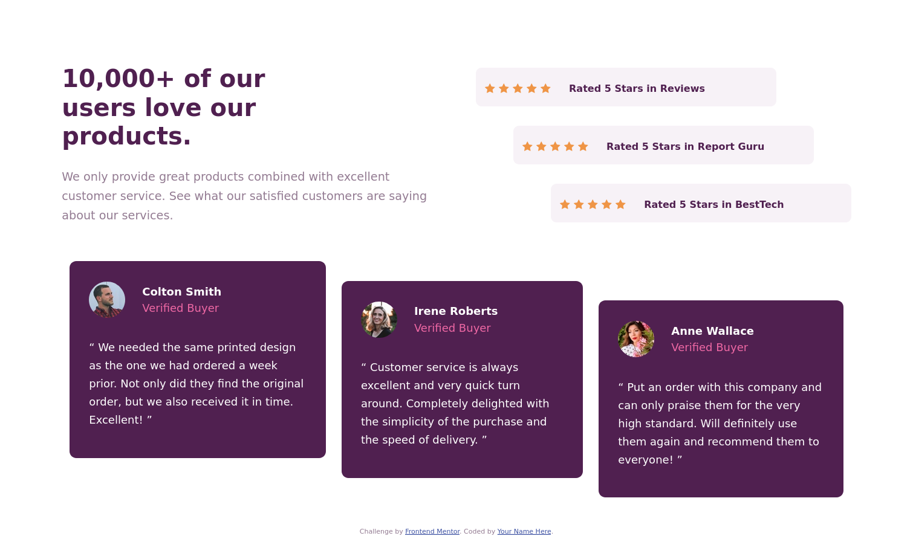

# Frontend Mentor - Social proof section solution

This is a solution to
the [Social proof section challenge on Frontend Mentor](https://www.frontendmentor.io/challenges/social-proof-section-6e0qTv_bA)
. Frontend Mentor challenges help you improve your coding skills by building realistic projects.

## Table of contents

- [Overview](#overview)
    - [The challenge](#the-challenge)
    - [Screenshot](#screenshot)
    - [Links](#links)
- [My process](#my-process)
    - [Built with](#built-with)
    - [What I learned](#what-i-learned)
    - [Continued development](#continued-development)
    - [Useful resources](#useful-resources)
- [Author](#author)

## Overview

### The challenge

Users should be able to:

- View the optimal layout for the section depending on their device's screen size

### Screenshot

### Links

- Solution URL: [GitHub Repository](https://github.com/cyberraff/social-proof-section)
- Live Site URL: [Live Site](https://social-proof-section-nu-ten.vercel.app/)

## My process

### Built with

- Semantic HTML5 markup
- CSS custom properties
- Flexbox
- CSS Grid
- Mobile-first workflow

### What I learned

I tried out saas for the first time while creating the project, and I am really getting thr hang of it.

### Continued development

Will br developing my React skills from now and will also be using saas, so I can be really comfortable with it.

### Useful resources

- [StackOverflow](https://www.stackoverfllow.com) - this helped me a lot with most of the questions I had to ask during
  the processes of creating this project.

## Author

- Website - [Still a work in process ()
- Frontend Mentor - [@cyberraff](https://www.frontendmentor.io/profile/cyberraff
- Twitter - [@raphaellosanti_](https://www.twitter.com/raphaellosanti_)
